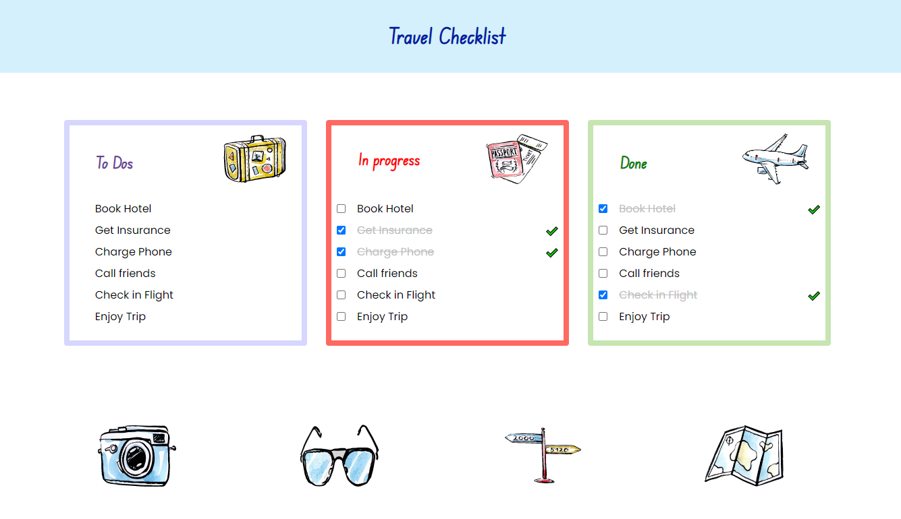

# CSS Cascade, Selection and Pseudo Selectors
Exploring Authoring Techniques with CSS - Authoring 1
  

  

<h1 align ="center"> Travel Checklist</h1>

 
 The best way to get organized before you leave for vacation!
  

 
🖥️ HTML | CSS 

